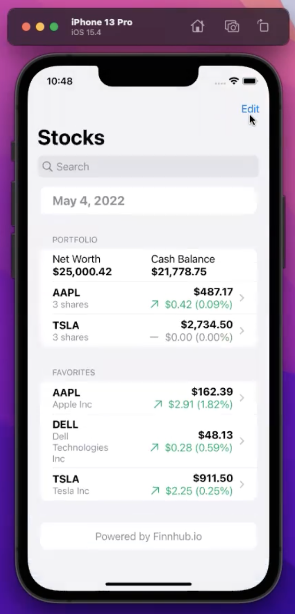
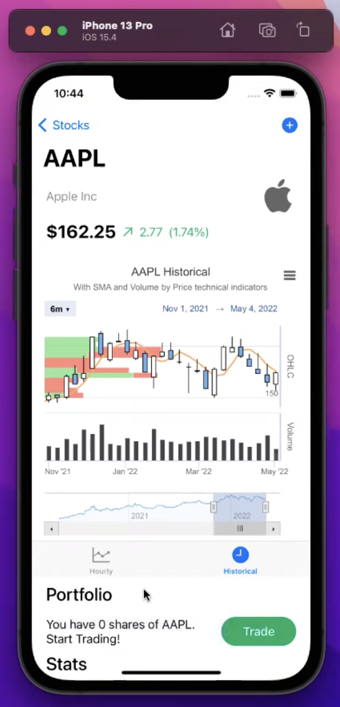

# Stock App (IOS) Demo
Video Link: **https://www.youtube.com/watch?v=o9rVl8rgssw**
 
This IOS application is implemented with SwiftUI framework. Backend service for calling APIs is using Node.js framework, and running on Google Cloud Platform. Source codes will be provided on request.
  
 &nbsp; &nbsp; &nbsp; &nbsp;

